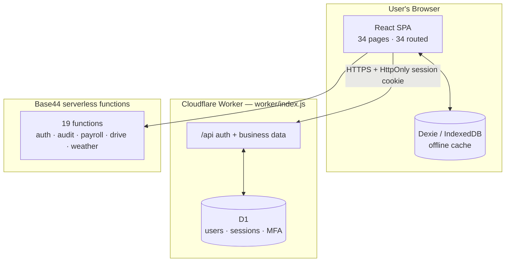

<div align="center">

# Red Roof Intelligence

**Hotel analytics and operations for a Red Roof property — revenue, occupancy,
booking sources, payroll, expenses, and a tamper-evident audit trail.**

Offline-capable by design. Money is integer cents. The audit log is a hash chain.

[Start here](#start-here) · [Architecture](#architecture) · [Verification](#verification) ·
[Governance](#governance-and-protected-files) · [Documentation](#documentation-map)

</div>

---

## What this is

A React + Vite single-page app for running one hotel property, backed by
[Base44](https://base44.com) serverless functions and a Cloudflare Worker holding
authentication and business data in D1.

Three properties define the codebase, and almost every rule below exists to
protect one of them:

1. **The front desk keeps working when the network does not.** A Dexie/IndexedDB
   cache holds the working set locally; the UI stays usable offline and syncs when
   connectivity returns.
2. **Money is never floating-point.** All financial arithmetic goes through
   `src/lib/decimal.js`. Dollar values are integer cents end to end.
3. **The audit trail is tamper-evident.** Entries form an HMAC hash chain keyed by
   a server-side secret, so altering history breaks verification instead of
   silently rewriting it.

**Size, as observed on this branch:** **34 page components** under `src/pages/`,
**all 34 routed** in `src/App.jsx`; 16 Base44 entities; 19 serverless functions;
56 shadcn/ui primitives in `src/components/ui/`; 152 modules in `src/lib/`; 20 Worker
JavaScript modules plus a `schema.sql`; 8 D1 migrations. `package.json` is `private: true` at version `0.0.0` —
this is not a published npm package.

> [!NOTE]
> **These counts exclude tests.** Unit tests are colocated beside the code they
> cover — 7 `*.test.jsx` under `src/pages/` and 19 under `src/components/ui/` —
> so a plain directory listing overstates both. `src/App.jsx` declares 37
> `<Route>` elements, but three are not pages: a redirect, a layout wildcard, and
> the 404 catch-all.

> [!NOTE]
> This repository has **no `LICENSE` file and no `CONTRIBUTING.md`.** It is
> private, first-party work. Do not assume an upstream license or an external
> contribution process exists.

## Start here

```bash
git clone https://github.com/divyesh01/boston_project.git
cd boston_project
npm install
cp .env.example .env.local     # fill it in — every name is annotated in that file
npm run dev
```

Requires Node `^22.22.2 || ^24.15.0 || >=26.0.0` (from `package.json` `engines`);
CI runs Node 24.

### Configuration

`.env.example` is the authoritative list of environment variables. Each one is
annotated with the file and line that reads it, and that file is unusually worth
reading in full — several entries document behaviour that is easy to get wrong.

**Vite only exposes `VITE_`-prefixed variables to the browser. Treat every value
in a `.env` file as public.**

| Variable | Purpose | Danger if wrong |
|---|---|---|
| `VITE_BASE44_APP_ID` | Cloud app id — read at `src/api/base44Client.js:112` | Falls back to the hardcoded `PRODUCTION_APP_ID` constant (`base44Client.js:51`). An unconfigured build **does not fail**; it quietly talks to the production tenant. Set it explicitly in every environment. |
| `VITE_BASE44_BACKEND_URL` | Backend origin for the SDK (defaults to `""`) | Rarely wrong; usually left blank. |
| `VITE_USE_LOCAL_AUTH` | In-browser offline auth shim | Read as a **string** compare against `'true'` at `base44Client.js:2278`, so only that exact text enables it. `true` in a deployed build means the browser performs its own auth and MFA — trivially bypassable. Keep it `false` outside `.env.development`. |
| `VITE_STANDALONE_LOCAL` | Declares the standalone deployment (local auth inside a production bundle behind Cloudflare Access) | Two flags rather than one so it cannot happen by accident. `src/main.jsx` refuses to boot a production build setting `VITE_USE_LOCAL_AUTH=true` without it. Never set on a build reachable anonymously. |
| `VITE_WEBSOCKET_ENDPOINT` | CRDT sync endpoint (read at `src/crdt.jsx:25`) | Blank disables realtime sync; the app is offline-first regardless. A value that is not `ws://`/`wss://` is treated as unset and warns rather than failing. |
| `VITE_BASE44_APP_BASE_URL`, `VITE_BASE44_FUNCTIONS_VERSION` | **Declared but currently inert** | Consumed only by `src/lib/app-params.js`, which nothing in `src/` imports, so Vite drops them. `scripts/probe-app-config.mjs` fails if an importer appears. Do not "fix" this by adding an import — `app_id` and `functions_version` would become attacker-settable via a crafted link. |

> [!WARNING]
> **Server-side secrets are not environment variables.** `AUDIT_CHAIN_SECRET`,
> `OPENWEATHER_API_KEY`, and `CRON_SECRET` are read from the Base44 secret store
> via `secrets.get()`, not `process.env`. Adding them to a `.env` file accomplishes
> nothing except risking a commit. Set them with the Base44 CLI or dashboard.
>
> `AUDIT_CHAIN_SECRET` **fails closed**: `custom_user_admin/entry.js:524` refuses
> every non-read-only action when it is unset, because a privileged change that
> cannot be recorded must not happen. `OPENWEATHER_API_KEY` is proxied by
> `getWeather` precisely so the key never reaches the browser.

### How it fits together

- **Browser (React SPA)** — pages and components, plus a Dexie/IndexedDB cache and
  optional CRDT sync for collaborative editing.
- **Cloudflare Worker** (`worker/index.js`) — serves same-origin `/api`
  authentication and business data from D1. 20 modules covering auth, TOTP,
  password policy, sessions, bulk import, aggregates, and the HotelKey schema
  registry.
- **Base44 serverless functions** (`base44/functions/`) — 19 functions spanning
  auth, user administration, the audit chain, payroll, weather proxying, and
  Google Drive backup/import.
- **Integrations** — Google Drive (backup), OpenWeather (weather proxy).

`BRAIN.md` carries an up-to-date Mermaid diagram of the same topology.

## Commands

Run these exactly as defined in `package.json`.

| Command | What it does |
|---|---|
| `npm run dev` | Vite dev server |
| `npm run build` | Production build |
| `npm run preview` | Serve the production build locally |
| `npm run verify:all` | **Every** probe/verify suite — start here after any change |
| `npm run lint` / `npm run lint:fix` | ESLint (`--quiet`); 0 errors expected |
| `npm run typecheck` | `tsc -p ./jsconfig.json` with `checkJs` |
| `npm test` / `npm run test:watch` / `npm run test:coverage` | Vitest unit tests |
| `npm run map:verify` | Repository-map documentation gate |
| `npm run map:mutate` | Mutation harness for the repo-map gate |
| `npm run hotelkey:mutate` | Mutation harness for HotelKey ingestion |
| `npm run hotelkey:crashsafe` | Crash-safety harness for the above |
| `npm run mutate:all` | All three mutation harnesses in sequence |
| `npm run audit:gate` | Audit-trail gate |
| `npm run brain:map` | Regenerates `docs/brain/BRAIN_DEPENDENCIES.md` — never hand-edit it |
| `npm run brain:verify` | Documentation gate (a git hook), not a behaviour suite |
| `npm run verify:v3` | DIVYESH V3 protocol + manifest verification |
| `npm run ws` | Standalone WebSocket server (`backend/websocket.js`) |

> [!IMPORTANT]
> **Use `npm run typecheck`, never bare `npx tsc --noEmit`.** This repository uses
> `jsconfig.json`; the bare command resolves to the wrong package and has
> previously checked nothing useful.

Typical order for a change:

```bash
npm run typecheck
npm run lint
npm test
npm run verify:all
npm run build
```

If the full sweep exceeds one command's window, shard it — and confirm every shard
printed the **same** fingerprint before adding the results up:

```bash
npm run verify:all -- --shard 1/12
```

### Verification architecture

This repository treats "the suite could not start" as a **distinct outcome from
"the suite passed"** — a distinction most projects do not make, and the single
most important thing to understand about `verify:all`.

`scripts/verify-all.mjs` auto-discovers every `scripts/probe-*.mjs` and
`scripts/verify-*.mjs` and reports six distinct outcomes, so a suite that could
not *start* never looks like one that passed. Every run prints a
`list <id> (<n> discovered)` fingerprint; that fingerprint is the identity of the
suite list, not a pass result.

Useful flags: `--list`, `--filter <substring>`, `--shard i/n`, `--bail`, `--json`.

**Seven scripts are deliberately excluded from discovery** because they are
gates or harnesses rather than behaviour suites, each with a documented reason:
the runner itself, the two documentation gates, the two in-place mutation
harnesses, the crash-safety harness (it holds `.git/index.lock` for a whole run),
and `probe-worker-auth-remote.mjs` (it creates real remote D1 databases and must be
run only with deliberate opt-in).

Running a **single** suite needs the loader, which resolves the `@/` alias:

```bash
node --import ./scripts/_loader-boot.mjs scripts/probe-<name>.mjs
```

> [!CAUTION]
> **A bare `node scripts/verify-*.mjs` will fail in a way that looks like
> repository rot.** The `@/` alias is unresolved without the loader boot, and the
> resulting errors resemble real breakage. Always pass `--import ./scripts/_loader-boot.mjs`.

#### Current baseline

Counts change as suites are added, so read the number rather than trusting a
number copied from a document. To get the live figure:

```bash
npm run verify:all -- --list
```

**OBSERVED on this branch:** `205 suite(s) — list 0c3a0b5a (205 discovered)`.

> [!WARNING]
> **Older documents disagree with each other, and all of them predate the branch
> you are reading.** `BRAIN.md` records 150 suites / `2b819cc2` (2026-09-05);
> `README.md` previously recorded 111 / `2f3a5c5a` (2026-08-25). Live discovery on
> this branch reports **205 suites / `0c3a0b5a`**. Trust `npm run verify:all -- --list`
> over any number written in prose, and treat a skip as *not run* rather than as
> a pass. `BRAIN.md` §"Current verification baseline" is the closest thing to an
> authoritative record, but verify before quoting it.

### CI

Two GitHub Actions workflows:

- **`deep-verification.yml`** — runs on pull requests and pushes to `main`, plus a
  schedule. A `protocol` job runs `npm run verify:v3`; a `suites` job fans the
  verification sweep across a **12-shard** matrix on `ubuntu-latest` with
  `fail-fast: false`; an `environment_probes` job covers environment-dependent
  probes.
- **`security.yml`** — the security gate.

Because CI shards, a red build can be a shard-local failure. Check the individual
shard before assuming the whole suite broke.

### Mutation testing

Three harnesses verify the verification suite itself — that the checks can fail:

- `map:mutate` — mutates the repo-map gate; recorded as **17/17 killed**, restore
  byte-identical, post-restore gate exit 0.
- `hotelkey:mutate` — recorded as **11/11 killed**.
- `hotelkey:crashsafe` — recorded as **10/10, residue none**.

> [!WARNING]
> **Check `git status -- src/` after any harness run.** These harnesses mutate
> tracked source in place and `map:mutate` has no dirty-start guard. A harness
> that times out can leave residue that poisons later suites — index-lock readers
> exit 0, writers exit 128, so a "passing" run may mean nothing ran.

## Architecture



### Data model — 16 Base44 entities

Grouped by domain:

| Domain | Entities |
|---|---|
| Property & tenancy | `Property` |
| Identity & access | `User`, `Session`, `RateLimit` |
| Financial core | `GrossRevenueDay`, `PaymentDay`, `Expense`, `PayrollRun` |
| Operations | `OccupancyDay`, `SourceDay`, `Staff`, `TimecardPunch`, `ClerkShiftRecord` |
| Ingestion & audit | `UploadedReport`, `AuditLog`, `Channel` |

Each is a `.jsonc` schema in `base44/entities/`.

### Serverless functions — 19

**Authentication (7):** `custom_auth_login`, `custom_auth_register`,
`custom_auth_logout`, `custom_auth_me`, `custom_auth_check`,
`custom_auth_reset_request`, `custom_auth_reset_password`

**User administration (1):** `custom_user_admin` — the only automated check on it
is `probe-auth-hardening.mjs`, and it fails closed without `AUDIT_CHAIN_SECRET`.

**Audit chain (4):** `audit_log`, `audit_list`, `audit_verify`, `audit_clear`

**Business operations (7):** `autoPayroll`, `backupToDrive`, `importDriveFile`,
`listDriveFiles`, `getWeather`, `aiAssistant`, `deleteAccount`

### Cloudflare Worker — 20 JavaScript modules

`worker/index.js` is the entry point, alongside a `schema.sql`. Notable modules: `auth.js`, `totp.js`,
`session-permissions.js`, `password-policy.js`, `password-credential.js`,
`scope.js`, `entities.js`, `aggregates.js`, `bulk-import.js`, `bulk-contract.js`,
`import.js`, `budget.js`, `settings.js`, `r2-s3-adapter.js`, `db.js`,
`hotelkey-schema-registry.js`, `business-sync.js`, `users.js`, `app-auth.js`.

**D1 migrations** (`migrations-production/`, 8 files, applied in order):
`0001_auth_schema` · `0002_business_sync` · `0003_property_columns` ·
`0004_staging_and_rollback_schema` · `0005_bulk_import_manifest` ·
`0006_bulk_import_integrity` · `0007_bulk_import_lineage` ·
`0008_property_day_summary`.

### Money handling

`src/lib/decimal.js` is the only place dollar arithmetic happens. Values are
integer cents; floating-point `+` and `-` on dollar amounts is forbidden because
it drifts — measured: `2.05 - 2.01` is `0.040000000000000036`.

> [!CAUTION]
> **`multiply(a, b)` treats `b` as a *rate*, not a count.** This is the single most
> common source of wrong money in this codebase.

The year-to-date gross reconciles exactly to the cent — `$1,020,598.17` =
`$1,011,258.67` room + `$9,339.50` ancillary — and
`scripts/probe-money-kept-gross.mjs` holds that to the cent.

### Offline and sync

A Dexie/IndexedDB cache holds the working set so the front desk stays usable
without a network. Realtime sync is optional and CRDT-based (`yjs` +
`y-websocket`), enabled only when `VITE_WEBSOCKET_ENDPOINT` is set; a standalone
server runs via `npm run ws`.

### Property isolation

Every business record is scoped by `property_id`. One property must never read or
mutate another property's data. This is treated as a hostile-input boundary, not a
filter applied at the UI layer.

> [!IMPORTANT]
> **`property_id_map` is migration-only and is never read in production.** Import
> resolves `property_code` against the `property` roster; `property_id_map` exists
> to migrate legacy rows. Do not start reading it in application code.

### HotelKey ingestion

The ingestion order is fixed and each stage has an audit:

```text
raw input -> parse -> normalize -> validate -> sanitize -> persist -> consume
```

Malformed upstream data is never hidden behind a UI fallback. Regression fixtures
are **synthetic and contain no real guest, hotel, PMS, or production data** — see
[`src/lib/__fixtures__/hotelkey/README.md`](src/lib/__fixtures__/hotelkey/README.md).

### UI state honesty

Loading, error, empty, permission-denied, and unavailable are **five different
states**. Collapsing them into one empty screen or an invented default value is a
defect, not a cosmetic issue.

## Security

Security boundaries are treated as hostile input: authentication, authorization,
session state, audit trails, CSV imports, and `property_id` isolation. Negative
cases matter — unauthorized access must fail.

- **Authentication** — session cookies, TOTP/MFA, cross-tab revocation.
- **Authorization** — role-based access control with per-route permission
  mappings in `src/lib/permissions.js`.
- **Audit** — HMAC hash chain keyed by `AUDIT_CHAIN_SECRET`; verification is a
  serverless function, not a client-side claim.
- **Secrets** — never in `.env` files; never in the repository.
- **Deployment headers** — `vercel.json` ships a strict CSP (`default-src 'self'`,
  `frame-ancestors 'none'`, `object-src 'none'`), HSTS with a two-year max-age,
  `X-Frame-Options: DENY`, `nosniff`, `Referrer-Policy`, COOP/CORP, and a
  `Permissions-Policy` disabling camera, microphone, geolocation, payment, and
  USB. Hashed assets are cached immutable for one year.

Read [`INFRASTRUCTURE_SECURITY.md`](INFRASTRUCTURE_SECURITY.md) for the
infrastructure playbook and [`SECURITY.md`](SECURITY.md) for the security
directives.

## Governance and protected files

> [!CAUTION]
> **Read [`PROTECTED_FILES.md`](PROTECTED_FILES.md) before editing anything.**
> Fourteen files are locked and require explicit, file-specific owner
> authorization: the auth/security core (`base44Client.js`, `AuthContext.jsx`,
> `security.js`, `securityUtils.js`, `permissions.js`, `validator.js`), the four
> auth pages, and the AI agent rules themselves (`AGENTS.md`, `CLAUDE.md`,
> `PROTECTED_FILES.md`, `.agents/rules/no-modify-protected.md`).
>
> **"Locked" means no edits and no workarounds.** No copies, no `v2` variants, no
> wrappers, no monkey-patches, no runtime overrides.

### DIVYESH V3 protocol

This repository is governed by a versioned agent protocol verified on every
substantive change:

```bash
npm run verify:v3
```

**OBSERVED on this branch:** `PASS 3.0.0`, 31 canonical files, 6 active adapters,
protocol hash `sha256:8998c0c8…`.

If the manifest, protocol hash, or bootstrap verification disagrees, the correct
response is `SYSTEM_DRIFT = BLOCKED` and no substantive work. The packs live under
`docs/divyesh-v3/`: a kernel, a router, a quality-first compute policy, **9 role
packs** (commander, editor, tester, VANSH, NISARG-1/2/3, owner-agent,
independent-attacker), **8 domain packs** (auth-security, finance,
imports-ingestion, property-isolation, privacy-destructive, ui-accessibility,
deployment-operations, incident-recovery), and **5 workflow packs** (read-only,
low-risk-change, standard-change, high-risk-change, production-incident).

### The five-step working agreement

1. **SCAN** — read `BRAIN.md`, then the one relevant spoke.
2. **PROVE** — write a test.
3. **FIX** — fix the core, not the symptom.
4. **VERIFY** — run the test.
5. **UPDATE** — update the relevant `BRAIN_*.md`. *Enforced by a git hook.*

## Documentation map

`BRAIN.md` in the repo root is a **routing hub**, not a document to read end to
end. It contains only routing; the depth lives in seven spokes. Read the hub, then
the single spoke your task needs — the spokes exist so a new engineer or agent
never has to scan the whole project.

| I want to change… | Read |
|---|---|
| Money, formulas, reconciliation | [`docs/brain/BRAIN_FINANCE.md`](docs/brain/BRAIN_FINANCE.md) |
| Auth, MFA, sessions, audit logs | [`docs/brain/BRAIN_SECURITY.md`](docs/brain/BRAIN_SECURITY.md) |
| React UI, pages, components, hooks | [`docs/brain/BRAIN_FRONTEND.md`](docs/brain/BRAIN_FRONTEND.md) |
| Entities, serverless functions, config | [`docs/brain/BRAIN_BACKEND.md`](docs/brain/BRAIN_BACKEND.md) |
| Diagnose a known problem | [`docs/brain/BRAIN_TROUBLESHOOTING.md`](docs/brain/BRAIN_TROUBLESHOOTING.md) |
| What breaks if I edit this file | [`docs/brain/BRAIN_DEPENDENCIES.md`](docs/brain/BRAIN_DEPENDENCIES.md) *(auto-generated)* |
| The V3 protocol itself | [`docs/brain/BRAIN_DIVYESH_V3.md`](docs/brain/BRAIN_DIVYESH_V3.md) |

The root also holds directive documents — [`ARCHITECT.md`](ARCHITECT.md) (blast
radius), [`SECURITY.md`](SECURITY.md) (schemas, sanitization, audit logs),
[`TESTING.md`](TESTING.md) (empirical probing), [`UI_UX.md`](UI_UX.md) (user
friction), [`BUSINESS.md`](BUSINESS.md), [`PROJECT_MAP.md`](PROJECT_MAP.md),
[`TECH_DEBT.md`](TECH_DEBT.md) — plus the canonical engineering contract,
[`docs/engineering/AGENT_RULES.md`](docs/engineering/AGENT_RULES.md), which
`CLAUDE.md`, `AGENTS.md`, and `GEMINI.md` are thin adapters to.

`docs/TEST_MATRIX.md`, `docs/MODULE_CONTRACTS.md`, and `docs/AUTHORIZATION.md`
cover test coverage, module boundaries, and change authorization respectively.

## Contributing

There is no `CONTRIBUTING.md` and no pull-request template. The working agreement
is in [`docs/engineering/AGENT_RULES.md`](docs/engineering/AGENT_RULES.md) and the
five-step protocol in [`BRAIN.md`](BRAIN.md). The short version:

1. Branch — do not make ordinary implementation changes directly on `main`.
2. Prove first — reproduce the failure with the smallest useful test before fixing.
3. Fix the earliest broken boundary, not the downstream symptom.
4. Run `npm run typecheck`, `npm run lint`, `npm test`, `npm run verify:all`.
5. Update the relevant `BRAIN_*.md` — the git hook enforces this.
6. Never weaken an assertion to make a gate green. A test that cannot fail is not
   evidence.

## Environment limits worth knowing

These are **not** passing results. They are cases where a check could not run, and
must be recorded as *not run* rather than quietly skipped.

- **Cross-platform `node_modules`.** `npm test` and the acceptance harness will
  not run on Linux if `node_modules` was installed on Windows — Rollup's native
  binding is missing (`Cannot find module @rollup/rollup-linux-x64-gnu`). This is
  an environment limit, not a pass.
- **A skip is not a pass.** Environment-dependent probes skip when a dev server is
  absent (`probe-config-exposure.mjs` needs `localhost:5173`) or when `dist/` is
  stale (`probe-build-chunks.mjs` — `npm run build` turns it into a real run).
- **Remote probes are opt-in only.** `probe-worker-auth-remote.mjs` creates real
  remote D1 databases and mutates them against the Cloudflare account. It is
  excluded from discovery deliberately.

## License

No `LICENSE` file exists. This is private, first-party work with no declared
license. Do not redistribute it or assume reuse rights.